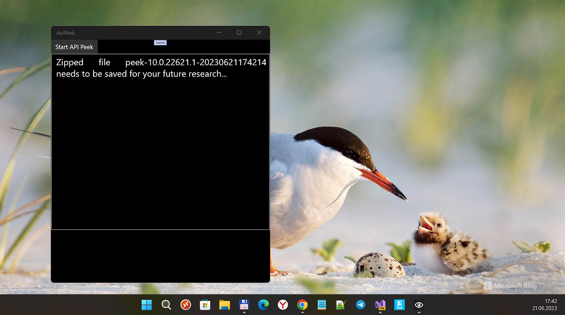
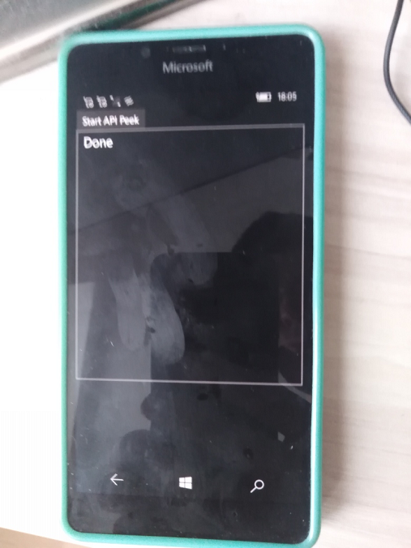

# ApiPeek v1.0.0-alpha

## About
About
Semi-mobile (UWP + Console app set) system for creating and comparing API dumps, from different versions of W10(M)...

## Screenshots



## A few words about the original ApiPeek

"
- Purpose 

"Library for creating and comparing API dumps, from different versions of Windows 10.  
[Sample API diff between Windows 10 1803 -> 1809](https://martinsuchan.github.io/ApiPeek/Diffs/win10.1803.to.win10.1809.fulldiff.html).  
[Simplified API diff between Windows 10 1803 -> 1809 with only new types](https://martinsuchan.github.io/ApiPeek/Diffs/win10.1803.to.win10.1809.diff.html).  
**ApiPeek library** can be used in Windows Phone 8.1+ and Windows 8.1+ projects.  
**ApiPeek.Compare tool** is a simple Console tool in .NET 4.5.2.

- The motivation

ApiPeek library was created in the Fall of 2014. My goal was to create a simple library for traversing all available OS API on
the target device using Reflection and save the result as a group of simple JSON files, each representing one assembly,
zipped together as a single ZIP file.  
  
The second goal of this project was a tool for comparing two API dumps from two different OS versions.
Initially I was able to create simple txt files with API diffs,
later I upgraded the Comparer tool to generate sexy [HTML tree diffs with collapsible sections](https://martinsuchan.github.io/ApiPeek/Diffs/win10.14257.to.win10.14267.fulldiff.html).

"

## Building the project

- The app is written in C# 6.0 
- I used Visual Studio 2022 Preview to (for) reverse-engeneering this cool tool.  
- SDK 19041 used; Min. Win. os build = 10240 (hello, "Project Astoria") 

## Creating API dumps

- Just build the **ApiPeek.App.UWP** project, then deploy it into your mobile phone.

- Run it on your windowsphone (i.e., Lumia 950 with os build 16212, or Lumia 640DS with "Astoria project")
 
- Click the **Start API Peek** button and wait couple of seconds.  
**File Save Picker** shows up, select where you want to save the API dump = .zip file.  

- Send the result to your PC.

## Comparing two API dumps

Currently the API compare process needs some manual steps.  

It's necessary to unzip both API dumps inside the **ApiPeek.Compare.App.Console** project inside the **api** folder.

Don't forget to set the property **Copy to Output Directory** on extracted files to **Always**.

Then select the target folder names in the **Program.cs** like this and start the Console app:

```
string path1 = "win10.10586";
string path2 = "win10.14267";
```

The Console app runs for only few seconds and then it automatically saves the diff inside the **bin/[Debug|Release]/html** folder.  

All API diffs I created so far are available here:  https://github.com/martinsuchan/martinsuchan.github.io/tree/master/ApiPeek/Diffs  
and can be browsed like this: https://martinsuchan.github.io/ApiPeek/Diffs/win10.14257.to.win10.14267.fulldiff.html

## Known issues

First of all this tool was created as a weekend hackathon project and the code documentation is mostly non-existent,
so please be warned before digging deeper how I done it :)  
I plan to update the documentation some time in the future + also delete some no longer used pieces of code.

Currently the ApiPeek library does not collect all information about the available API
**Not supported** features right now when traversing the API (non-exhaustive list):
 - overriden operators
 - constrains on generics
 - attributes on types
 - nested types
 
## References
- [https://github.com/martinsuchan/apipeek] Original ApiPeek by [Martin Suchan](https://github.com/martinsuchan)
- [Evolving the Reflection API](https://blogs.msdn.microsoft.com/dotnet/2012/08/28/evolving-the-reflection-api/)
- [Pure CSS collapsible tree menu](http://www.thecssninja.com/css/css-tree-menu)

## License
This project is licensed under the MIT License - see the [LICENSE](LICENSE) file for details


## ..
As is. No support. RnD only. DIY

## .
MediaExplorer 2023